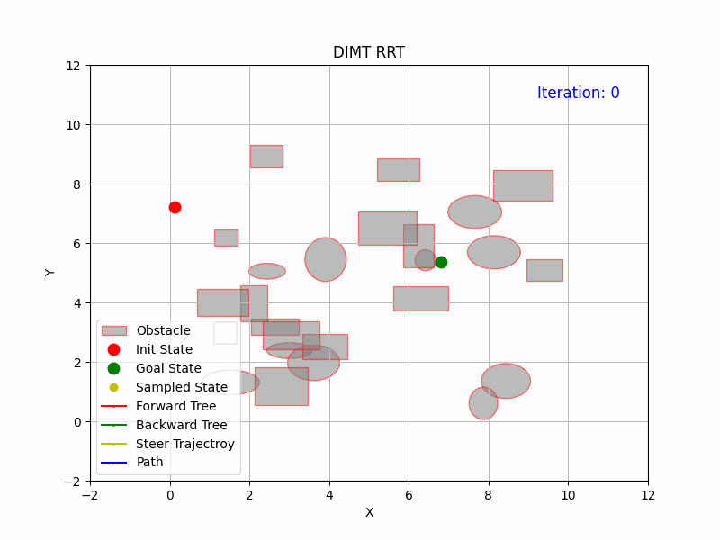

# DIMT-RRT
This repository contains a **Python** implementation of a kinodynamic planning algorithm integrating RRT with a steering method built on the "double-integrator minimum time" formulation from the paper **["Probabilistically Complete Kinodynamic Planning for Robot Manipulators with Acceleration Limits"](https://ieeexplore.ieee.org/document/6943083), IROS 2014**.

It operates several orders of magnitude faster than the [kinodynamic RRT](https://ieeexplore.ieee.org/document/770022) algorithm.

📌 Note: This implementation is a **reproduction** of the original paper.

## ✨ Example: Solving a 2D kinodynamic planning problem.

  

---

## 🛠 Usage
**[DIMT-RRT](https://github.com/cc299792458/dimt-rrt/blob/main/dimt_rrt.py)** corresponds to Section V of the paper. It differs from conventional kinodynamic RRT by employing a **steering** method that connects two states by solving the **Double-Integrator Minimum Time (DIMT)** problem. This approach enables a "connect" strategy rather than an "extend" strategy, which is one of the key factors behind its enhanced speed.

### Some Core Components

- **[Solving Quadratic Equations](https://github.com/cc299792458/dimt-rrt/blob/main/solve_quadratic.py)**  
  This corresponds to Section IV.A of the paper. It solves a quadratic equation and returns the solutions in an order such that |x₁| ≥ |x₂|.
  
- **[1-DOF Minimum Time](https://github.com/cc299792458/dimt-rrt/blob/main/one_dof_minimum_time.py)**
  This corresponds to Section IV.B of the paper. It computes the minimum time required to satisfy the specified boundary conditions and velocity/acceleration constraints for a single degree of freedom. **This problem always has a solution**.
  
- **[Infeasible Time Interval](https://github.com/cc299792458/dimt-rrt/blob/main/infeasible_time_interval.py)**
  This corresponds to Section IV.C of the paper. It returns the infeasible time interval if one exists. It first determines whether the goal state lies in Region I, and if so, calculates the corresponding infeasible time interval.
  
- **[Fixed-Time Trajectory](https://github.com/cc299792458/dimt-rrt/blob/main/fixed_time_trajectory.py)**
  This corresponds to Section IV.D of the paper. It computes the minimum acceleration required for a segment given the boundary conditions, along with the velocity and time constraints. **A solution is always guaranteed** based on the provided time inferred from both [1-DOF Minimum Time](https://github.com/cc299792458/dimt-rrt/blob/main/one_dof_minimum_time.py) and [Infeasible Time Interval](https://github.com/cc299792458/dimt-rrt/blob/main/infeasible_time_interval.py). Read the paper for more detials.
  
---
This implementation carefully handles several corner cases to ensure robust performance.

🌟If you find this useful, please star it—thank you! If you find any problems or suggestions, feel free to open an issue.
